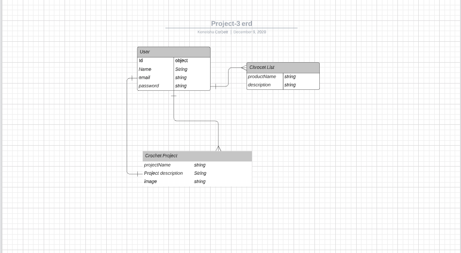
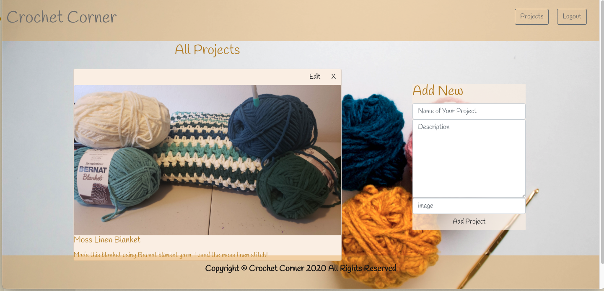

# Crochet Corner 
Crochet Corner is a full CRUD MERN stack.  Users are able to share images of their latest crochet  projects. This app features full user authentincation. If a user is not signed in they will not be allowed to see the contents of the app. 

## Technologies Used 
- React
- Mongoose
- Express
- Node.js
- AJAX
- Google Fonts 
- Unsplash

### Entity Relationship Diagram

### Wireframe

### ScreenShots

### Getting Started 
[click here](https://trello.com/b/D3Tqj2uI/crochet-corner) to see trello board

[click here](https://crochetcorner-frontend.netlify.app/) to see deployed app

### Future enhancements
- Add image upload instead of URL.
- Allow users to be able to comment on another users post
- Add a function that allows users to view the name of the user that made the post

